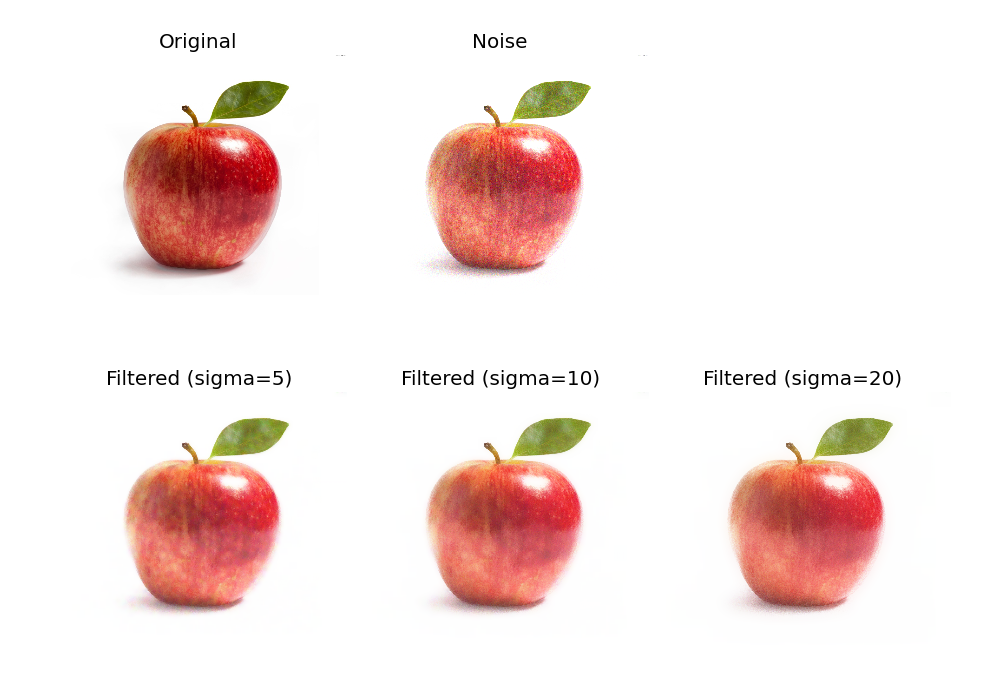
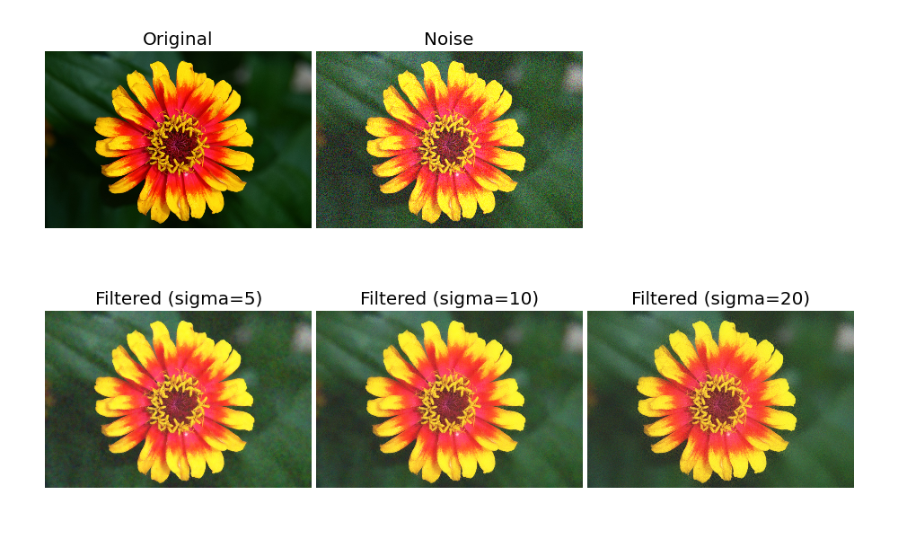
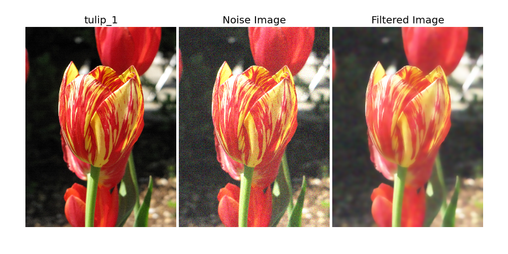

Guided Filter (Python)
====

Simple python demos of Guided Image Filtering [He et al. 2010].

The guided filter can perform edge-preserving smoothing filtering like the popular bilateral filter.

In this demo package, I also implemented **Fast Guided Filter** [He et al. 2015].

## Result

### Simple guided filter test for noise image:

* Original image as the guidance image.
* Noise image from the original image.
* Filtered output by the guided filter.





### Performance

Compare the original guided filter [He et al. 2010] and the fast version [He et al. 2015].

|Filter type  |time (secs)|
|-------------|-----------|
|Original ($\sigma = 10$)    |   0.215  |
|Original ($\sigma = 40$)    |   0.228  |
|Original ($\sigma = 80$)    |   0.254  |
|Fast version ($\sigma = 10$)    |  0.052 |
|Fast version ($\sigma = 40$)    |  0.053 |
|Fast version ($\sigma = 80$)    |  0.054 |


## Installation

*Note*: This program was only tested on **Windows** with **Python2.7**.
**Linux** and **Mac OS** are not officially supported,
but the following instructions might be helpful for installing on those environments.

### Dependencies
Please install the following required python modules.

* **NumPy**
* **SciPy**
* **matplotlib**
* **OpenCV**

As these modules are heavily dependent on NumPy modules, please install appropriate packages for your development environment (Python versions, 32-bit or 64-bit).
For 64-bit Windows, you can download the binaries from [**Unofficial Windows Binaries for Python Extension Packages**](http://www.lfd.uci.edu/~gohlke/pythonlibs/).

<!-- This program also uses **docopt** for CLI.
**docopt** will be installed automatically through the following **pip** command for main modules. -->

### Install main modules

You can use **pip** command for installing main modules.
Please run the following command from the shell.

``` bash
  > pip install git+https://github.com/tody411/GuidedFilter.git
```

## Usage
### Package Structure
* guided_filter: Main package.
    - main.py: Main module for testing.
    - results: Result images will be saved in the directory.

### Test Guided Filter Demo
You can test the Guided Filter with the following command from ```guided_filter``` directory..
``` bash
  > python main.py
```

This command will start downloading test images via Google Image API then run the ```guided_filter``` module to generate result images.

<!-- ## API Document

API document will be managed by [doxygen](http://www.stack.nl/~dimitri/doxygen/) framework.
Online version is provided in the following link:
* [**inversetoon API Document**](http://tody411.github.io/InverseToon/index.html) (html)

For a local copy, please use the following doxygen command from *doxygen* directory.
``` bash
  > doxygen doxygen_config
``` -->

<!-- ## Future tasks

* [ ] Performance tests. -->

## License

The MIT License 2015 (c) tody